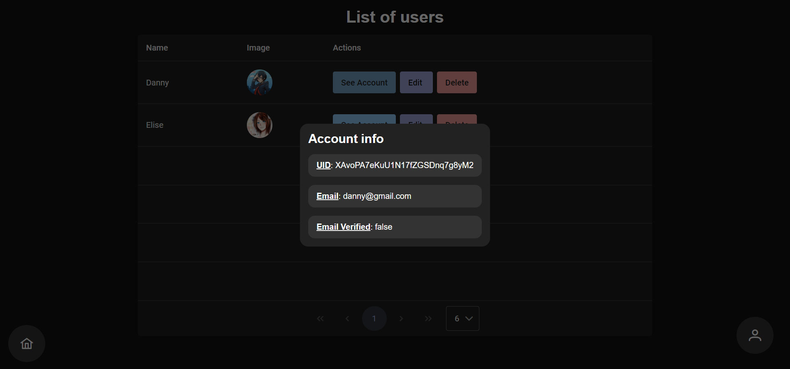

# TaskManagerAdministratorApp

Panel de administración realizado en Angular para la [aplicación móvil](https://github.com/Danny-06/proyecto-integrado) que hace uso de  
la [API creada en Python](https://github.com/Danny-06/python-firebase-admin).

<table>
  <tr>
    <td>
      
    </td>
  </tr>
</table>
